# What I Learned Running Image-Editing Models on a $530 Consumer GPU

I started this experiment in late May 2026 with a question that sounded simple: could I take an ordinary phone photo of a 3D-printed product and turn it into a genuinely attractive Etsy listing photograph without sending it to a cloud image service?

3D printing is another passion of mine. I sell some of the things I design and print through [NEWMANzoneCREATIONS on Etsy](https://www.etsy.com/shop/NEWMANzoneCREATIONS): playful wall hooks, desk organizers, and other functional pieces for kids' spaces. Designing and printing the object is the part I naturally want to spend time on. Producing a complete set of professional listing photographs can become a second project for every product.

The source photo did not need to be terrible. It just needed to be normal. Maybe the product was sitting on a granite counter, the light was coming from the wrong direction, or the background was a piece of fabric because that was what I had nearby. Professional product photography asks for much more: a clean backdrop, diffused key and fill light, controlled shadows, accurate color, useful scale, multiple angles, and believable scenes that show how the product fits into a real room.

I tried building a small tabletop studio. It helped, but it did not make the hard parts disappear. Lighting small 3D-printed objects evenly without flattening their texture is difficult. Hard shadows make the scene look cheap; too much diffusion can erase form. Glossy filament catches reflections, light colors shift, and a seamless background still does not create the bedroom, art table, or gift context a shopper needs. Every new design, color, or customization means arranging the lights, props, camera, and scene again. Hiring a professional or building a full studio would solve parts of that problem, but at a cost and scale that do not make sense for every small product experiment.

I wanted the model to do the staging while preserving the object. The rocket
organizer below is a direct statement of that goal. The source is an ordinary
product photo. FLUX.2 Klein turned it into a believable room-context photograph
in about seven seconds without requiring me to rebuild the physical scene. Both
images are traceable: the audit manifest records the source hash, raw ComfyUI
output hash, prompt, model, settings, seed, and elapsed time.

| Owned source photograph | Local FLUX.2 Klein room context |
|---|---|
|  | 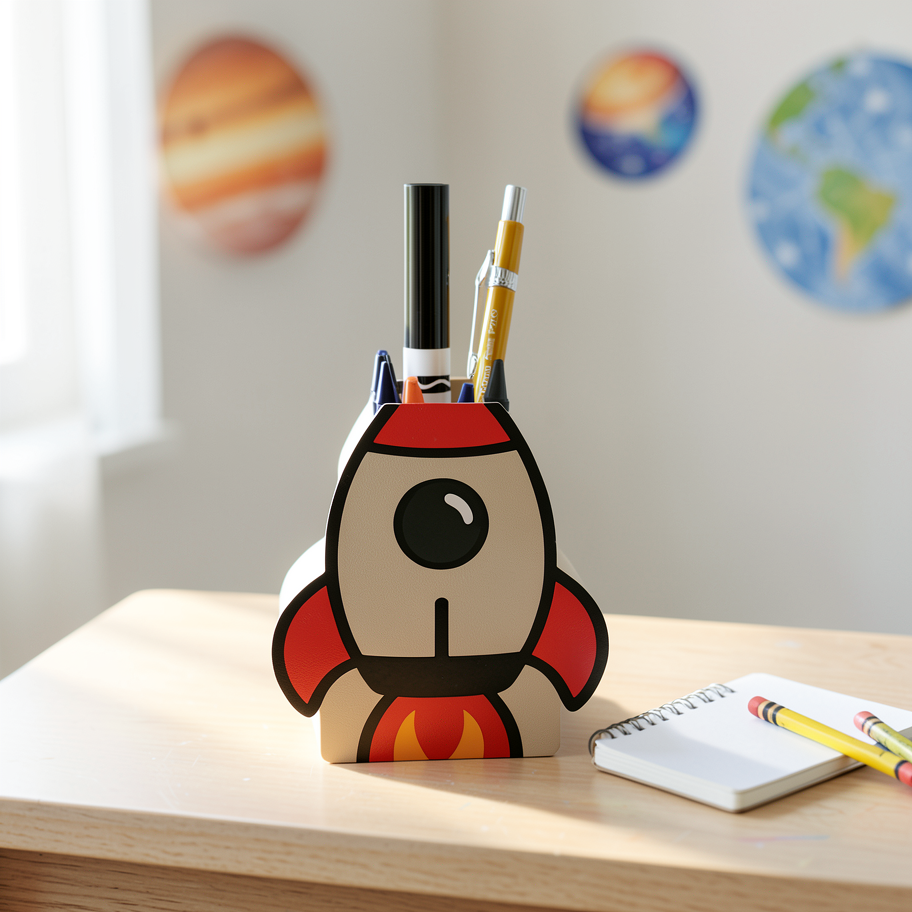 |

That turned into a much broader investigation. I tested model families, quantizations, text encoders, custom runtimes, step counts, resolutions, denoise values, warm and cold behavior, and a lot of prompts. I also learned that the configuration producing the best single image is not necessarily the system I want to operate.

My practical conclusion is:

- FLUX.2 Klein 4B is the model I would use most often for fast, attractive scene creation when I do not need the new scene to contain exact text.
- Native Qwen Image Edit 2511 is my personal favorite for product fidelity, existing artwork, and text-sensitive edits.

The path to that answer was the useful part.

## Local cost is not zero, but it changes behavior

Before getting into hardware, the obvious question is: **what is the point of
running this locally at all?** Cloud APIs remove setup work, scale immediately,
and often offer higher absolute quality. They also meter every candidate.

As of July 15, 2026:

- FLUX.2 Klein 4B API image editing started around $0.014 per image;
- Gemini 3.1 Flash Image was about $0.067 for a 1K image and $0.151 at 4K;
- Gemini 3 Pro Image was about $0.134 for a 1K/2K image;
- GPT Image 1 medium square images were $0.042 and high square images were $0.167, with portrait high images at $0.25.

This was never about recovering the purchase price of the GPU. I have several application ideas that depend on image generation, and a credible image feature needs much more than a few attractive demos. It needs model comparisons, prompt engineering, seed exploration, performance testing, regression suites, failure analysis, and repeated evaluation across different products and asset types.

A modest test matrix can become large very quickly:

```text
4 model routes * 20 products * 6 asset types * 5 prompt variants * 3 seeds
= 7,200 generated images
```

At $0.042 per image, that matrix costs about **$302**. At $0.067, it costs about **$482**, before higher-resolution runs, rejected experiments, or another project. A serious development cycle can easily require thousands of generations, and every failure is still a billable API call.

Local generation changes the kind of testing I am willing to do. I can sweep prompts, rerun a regression corpus after changing a workflow, compare quantizations, and inspect the ugly failures without watching each experiment increment an invoice. The GPU, electricity, setup, and engineering time are still real costs. The advantage is freedom to do the depth of experimentation that a good image product actually requires, across more than one project, while keeping private source material on my own machine.

## I wanted a local-AI card, not an image-only card

I bought a refurbished **PNY Dual Fan OC GeForce RTX 5060 Ti 16 GB GDDR7** for **$530 in May 2026**.

Image editing was one reason for the purchase, but not the only one. I wanted a machine where I could experiment with local LLMs, multimodal models, coding assistants, speech, embeddings, retrieval, and whatever interesting open model appeared next. That changed how I thought about the GPU.

An 8 GB card was not enough. It can run plenty of models, but it would force me into aggressive quantization, small context windows, CPU offload, or older image stacks too early. Twelve gigabytes looked like the minimum I was willing to consider. The 16 GB 5060 Ti deal was the best bang for the buck I could find in the low-friction CUDA ecosystem.

In hindsight, I am very glad I bought the 16 GB version. I am also much less likely to call 16 GB "a lot of VRAM" now.

## Parameter count is not the image-memory requirement

A 4B image model sounds as though it should fit comfortably on a 16 GB card. Sometimes it does. The complete workflow may not.

An image-editing graph can include:

- the diffusion transformer;
- a vision-language text encoder that reads both prompt and source image;
- a VAE for encoding the input and decoding the output;
- one or more LoRAs or distilled adapters;
- reference latents;
- attention buffers and intermediate tensors;
- custom-node runtime overhead;
- multiple model families loaded during a routing or comparison process.

Native Qwen peaked near 15.3 GB in one monitored run and still moved components between RAM and VRAM. GPU utilization averaged only around 47% during that observation, even though it peaked at 99%. The GPU was not lazy. The graph was alternating between text encoding, transfers, sampling, and decode work.

The same lesson applies to local LLMs. [Gemma 4 12B](https://huggingface.co/google/gemma-4-12B) is about 24 GB in BF16 before runtime overhead. Four-bit quantization makes a 12B-class model plausible on a 16 GB card, but the KV cache, multimodal inputs, and serving framework still matter. [Qwen3.6](https://huggingface.co/collections/Qwen/qwen36) begins at much larger total parameter counts, so its useful local configurations demand quantization and careful context planning.

VRAM capacity is not a spec-sheet footnote. It determines which experiments are pleasant, which merely run, and which quietly spend most of their time moving data.

## What the alternatives cost in July 2026

GPU pricing moves too quickly for a timeless table, so this is a dated snapshot. I bought my card in May; the prices below are the latest comparison I collected afterward, not the market as it looked on my purchase date. On **July 15, 2026**, I observed the following ordinary U.S. retail bands, excluding one-off local clearance deals and extreme marketplace listings:

| GPU | VRAM | Observed price band | My read for local AI |
|---|---:|---:|---|
| RTX 5060 Ti | 8 GB | $360-$395 | Cheap compute, but not enough memory for the range I wanted |
| RTX 5060 Ti | 16 GB | $565-$570 | The strongest affordable CUDA capacity tier in this comparison |
| RTX 5070 | 12 GB | $550-$670 | Faster compute paired with less memory |
| RTX 5070 Ti | 16 GB | $900-$1,100 | Faster, same capacity, much more expensive |
| RTX 5080 | 16 GB | $1,250-$1,600 | Considerably faster without solving the 16 GB ceiling |
| Used RTX 3090 | 24 GB | $1,189-$1,292 fair asking | Great capacity, high power, used risk, and an unusually hot market |
| RX 9060 XT | 16 GB | $400-$460 | Excellent hardware value if the exact software stack is validated |
| RX 9070 XT | 16 GB | $690-$850 | Strong compute and capacity with more Windows/custom-node uncertainty here |
| Intel Arc B580 | 12 GB | $300-$310 | Interesting entry point with less headroom and narrower workflow coverage |

The 12 GB RTX 5070 was the clearest example of why gaming tiers do not map neatly to local AI. It is faster than the 5060 Ti, but it would make the main constraint worse. The 5070 Ti and 5080 offered more speed, but neither increased capacity. The used 3090 was the capacity wildcard, although its asking price, power draw, age, and used-condition risk made it less attractive than it first appeared.

AMD looked excellent on paper. The 16 GB RX 9060 XT in particular deserves attention for a Linux-first or deliberately validated stack. My experiment was Windows, ComfyUI Desktop, CUDA-oriented models, and custom nodes. NVIDIA was not the cheapest silicon. It was the path with the fewest unknowns.

## The first successful images were not the final architecture

My early runs proved that the idea worked and then exposed everything that could go wrong.

<table>
  <tr>
    <td align="center"><br><sub><strong>Artifacts</strong><br>Noise and false stars overwhelm the product.</sub></td>
    <td align="center">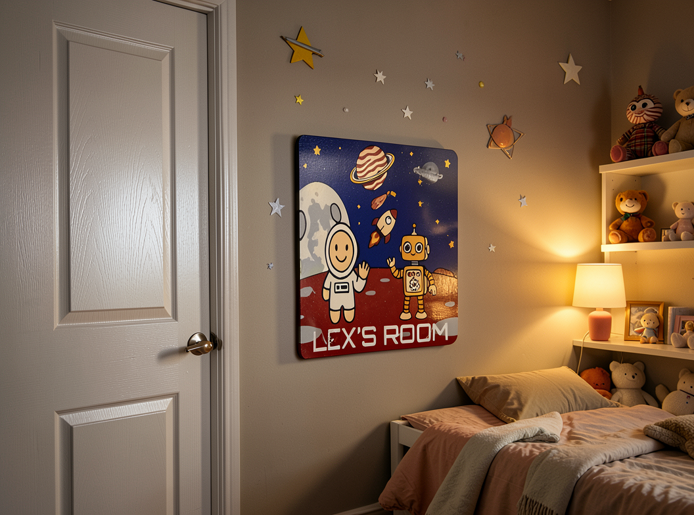<br><sub><strong>Identity drift</strong><br>The room looks good; the product is no longer exact.</sub></td>
    <td align="center">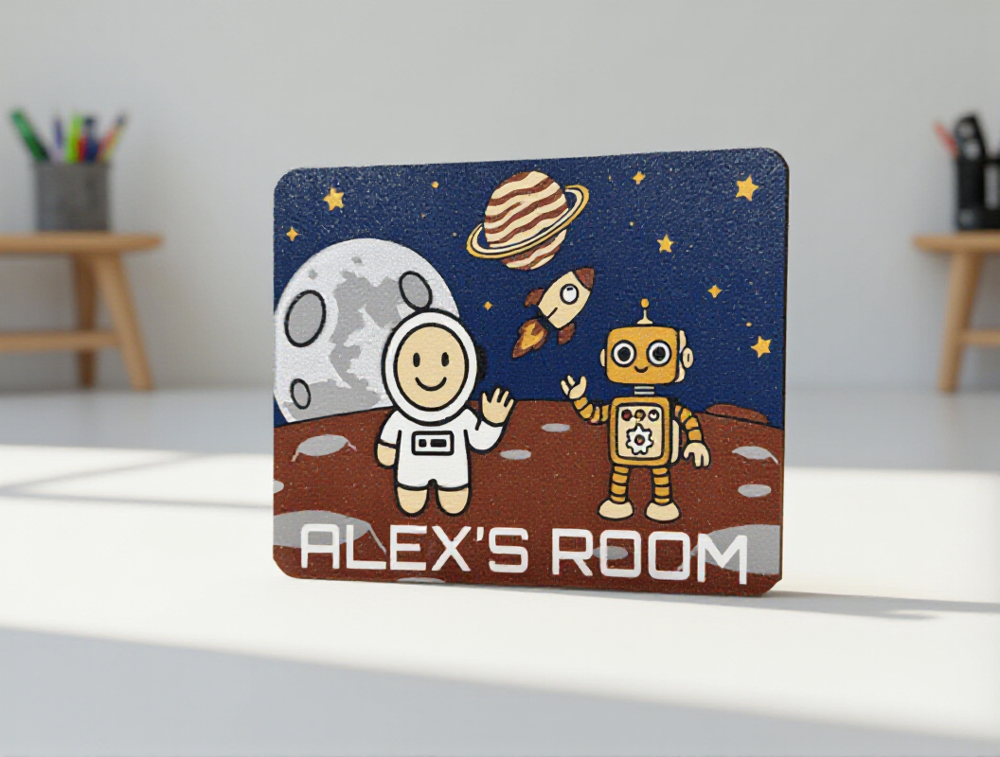<br><sub><strong>Soft geometry</strong><br>Edges and lettering lose definition.</sub></td>
    <td align="center">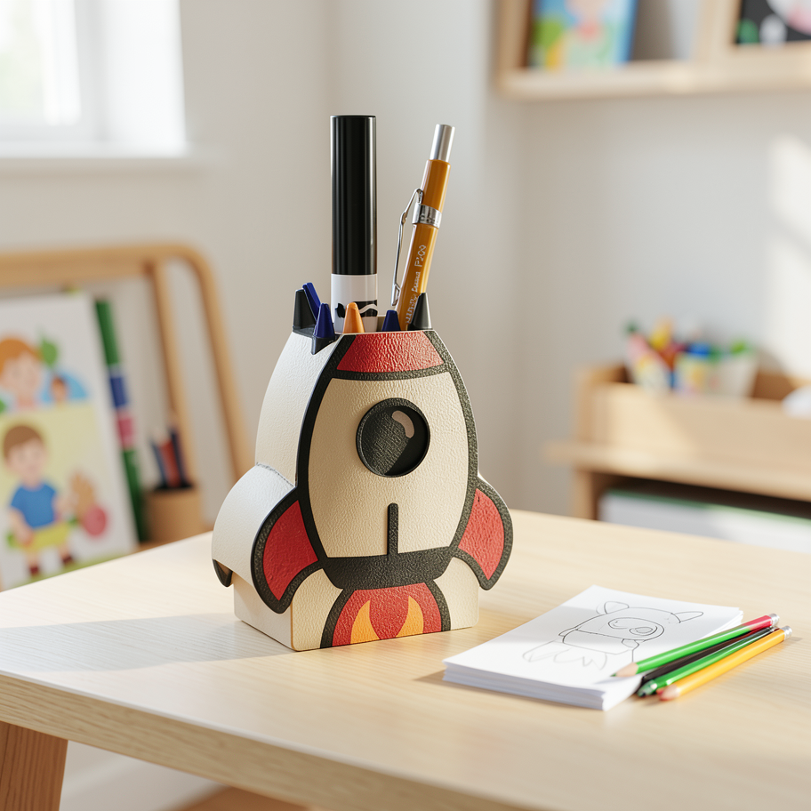<br><sub><strong>Quiet redesign</strong><br>Polished, but it invents a different organizer.</sub></td>
  </tr>
</table>

The first full-quality native Qwen graph took about six minutes per image. The output could be excellent, but that latency was unusable for an interactive product. Reducing resolution helped. Quantizing helped fit models. Neither automatically solved end-to-end latency.

I tried Qwen GGUF Q2 and Q3 variants. They reduced capacity pressure but did not beat the native Lightning path. I tried FLUX Kontext, Z-Image Turbo, FireRed, LongCat, and multiple FLUX.2 Klein configurations. Some were too slow. Some did not preserve the source. Some stayed too close to the original. Some looked attractive until I noticed that a name, edge, or piece of artwork had changed.

That last category was the most educational. A beautiful image is not a successful product edit if it depicts a different product.

## Native Qwen became my quality favorite

Qwen Image Edit 2511 was the first family that made the whole project feel dependable. It understood the source image, followed detailed edits, and preserved personalized text and product artwork better than the creative-first alternatives.

The first three examples below came from the slower 40-step native graph. They
were not the configuration I ultimately wanted to operate, but they established
the quality target: one source sign could become a clean hero, a realistic room
placement, and a gift-context image while retaining its defining artwork and
readable personalization. The fourth image came from the later optimized Qwen
route and showed that the same identity-first approach worked on a different
physical product.

<table>
  <tr>
    <td align="center">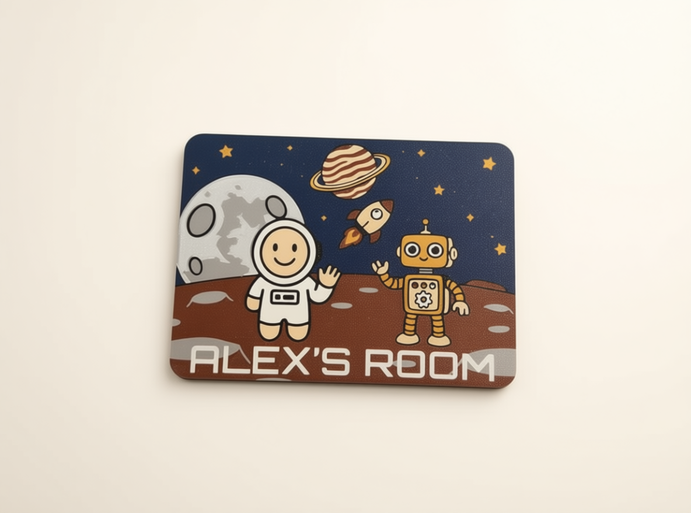<br><sub><strong>Clean hero</strong><br>40-step native Qwen quality target.</sub></td>
    <td align="center">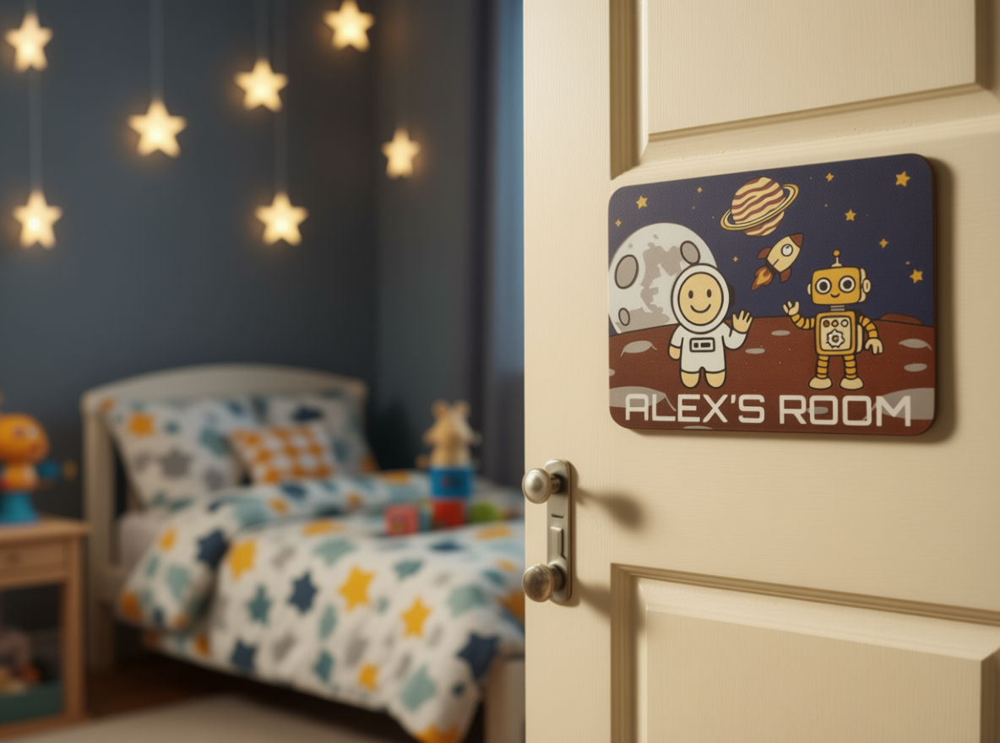<br><sub><strong>Room context</strong><br>Artwork, text, scale, and placement remain coherent.</sub></td>
  </tr>
  <tr>
    <td align="center">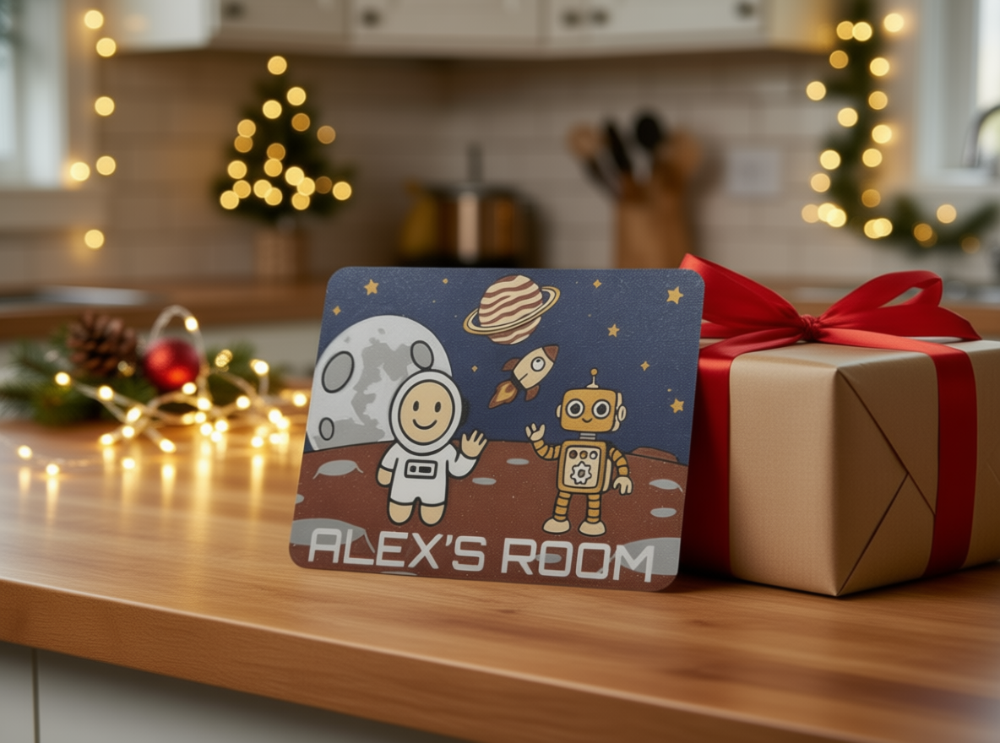<br><sub><strong>Gift context</strong><br>A different buyer story from the same source.</sub></td>
    <td align="center"><br><sub><strong>Optimized route</strong><br>A second product after the speed work.</sub></td>
  </tr>
</table>

The full graph was too slow, but the Lightning adapter changed the tradeoff. The accepted two-step, 768-class configuration completed in roughly **11-12 seconds warm** in the controlled tests. Three steps moved into the 22-26 second range and added polish. One step could be faster, but the details became smeary and text reliability fell apart.

Qwen is still not a photocopier. It can drift, and a production workflow must check it. But it was my favorite balance when the photographed identity mattered.

## FLUX.2 Klein was the practical winner

I originally treated FLUX.2 Klein too much like a preview model because one text-heavy test exposed its weakness. That was the wrong conclusion.

FLUX.2 Klein 4B is exceptionally useful when the requested scene does not need newly rendered text. It is fast, compositionally strong, and surprisingly consistent at making an object belong in a plausible environment. The FP8 distilled route at 0.8 MP generally landed around seven to eight seconds warm. July follow-ups with varied products and prompts landed between **6.6 and 8.4 seconds**. NVFP4 preview routes reached approximately four to seven seconds.

The opening rocket comparison established the basic result. I also wanted to
know whether the workflow could create several useful directions from that
source and then repeat the result on other real products. The two rocket scenes
below and five images from two more 3D-printed products were selected after I
reviewed the larger candidate sets, not just the first image returned by the
workflow.

<table>
  <tr>
    <td align="center">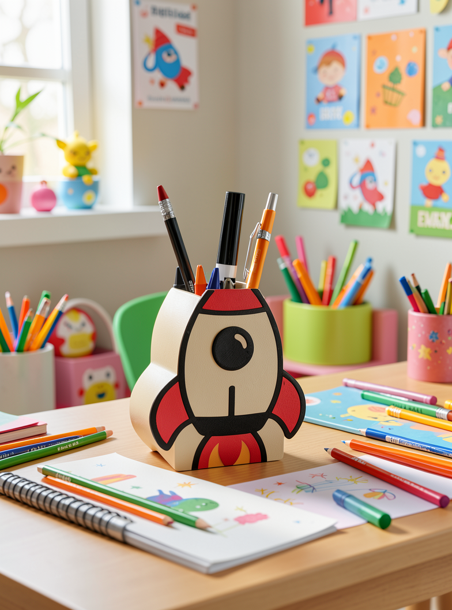<br><sub><strong>Rocket: classroom desk</strong><br>Colorful context with a clear product silhouette.</sub></td>
    <td align="center">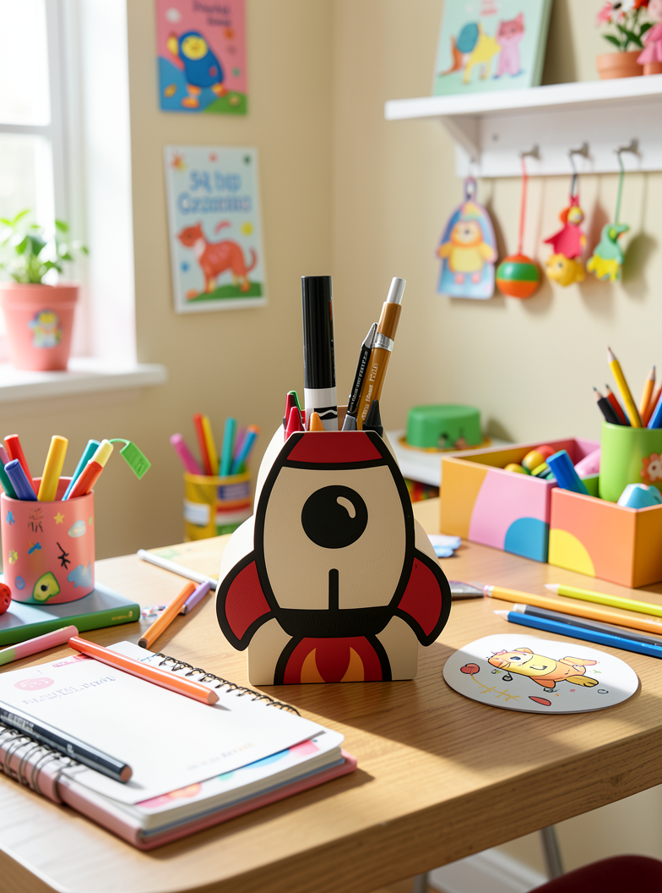<br><sub><strong>Rocket: craft desk</strong><br>A second room direction from the same ordinary source.</sub></td>
  </tr>
  <tr>
    <td align="center">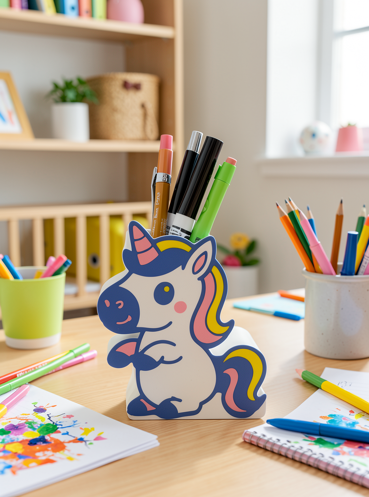<br><sub><strong>Unicorn: styled vignette</strong><br>Product-dominant framing with restrained stationery props.</sub></td>
    <td align="center">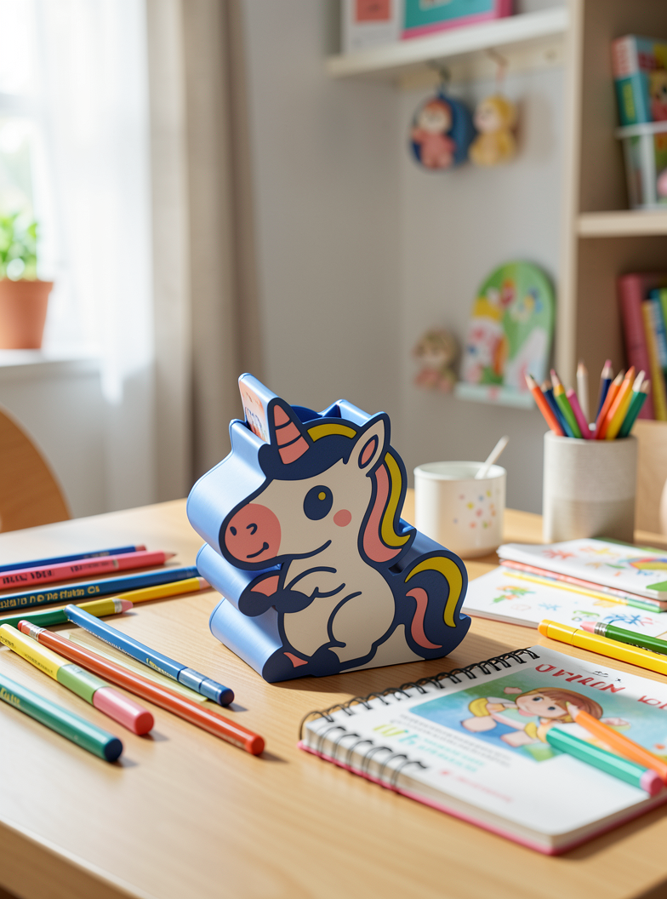<br><sub><strong>Unicorn: room context</strong><br>A plausible buyer setting without building the room physically.</sub></td>
  </tr>
  <tr>
    <td align="center"><br><sub><strong>Owl: homework desk</strong><br>Warm light and natural desk context.</sub></td>
    <td align="center"><br><sub><strong>Owl: everyday use</strong><br>A simpler scene with the product kept visually dominant.</sub></td>
    <td align="center"><br><sub><strong>Owl: classroom vignette</strong><br>A second buyer-relevant environment from the same source.</sub></td>
  </tr>
</table>

The three selected rocket images, including the opening comparison, came from
one owned source photograph and three prompt directions. The two unicorn images
came from separate owned source photographs. The three owl images came from one
source and three prompt directions. All eight used the same FLUX.2 Klein 4B FP8
route at 0.8 MP, six steps, Euler sampling, and CFG 1.0. The published files
preserve the generated pixels while stripping the embedded ComfyUI graph and
local file paths; raw and published hashes are kept in the experiment manifest.

This is the route that makes local iteration feel different. At that latency, trying another camera angle, prop set, or lighting direction is not a batch job. It is a conversation with the image.

FLUX still needs a preservation contract. It may simplify artwork, reinterpret small geometry, or invent lettering when asked. My practical rule is simple:

- if the scene can be text-free and the visual direction matters most, start with FLUX.2 Klein;
- if exact source text, artwork, or fine identity matters, start with native Qwen;
- validate either one before publication.

That is much more useful than labeling one model "best."

## Prompt engineering was half the project

Changing models was only part of the progress. The prompts changed substantially too.

Early prompts were broad: make this a great listing photo, use professional lighting, put it in a nice room. They gave the model too much freedom. The output might look good while quietly redesigning the product.

The useful pattern became:

### 1. Start with a preservation contract

I named the traits that define the object:

```text
Preserve the cream body, red fins and top panel, black outlines, orange flame,
circular black window, rectangular storage geometry, visible print texture,
and the same pens and markers.
```

The order matters. I put identity before styling so the prompt did not begin by telling the model to be creative.

### 2. Ask for one asset type

A clean hero, a lifestyle scene, a detail crop, and a dimension graphic have different composition rules. Asking for all of them in one prompt produces muddled work.

For a lifestyle image, I described the environment and why the object belonged there. For a clean hero, I removed props and asked for controlled light. For a scale or dimension image, I eventually stopped asking the generative model to render measurements at all.

### 3. Describe physical integration

The phrases that improved believability were practical photography instructions:

- natural three-quarter camera angle;
- soft daylight from the left;
- realistic contact shadow;
- coherent reflections;
- shallow depth of field;
- complete silhouette visible;
- uncluttered background.

These details helped solve the "cutout pasted on a background" look. The model needed to reason about how the new scene lit and supported the object.

### 4. Close the escape hatches

I ended with explicit exclusions:

```text
Do not add, remove, duplicate, resize, or redesign the organizer or its
contents. No text, labels, badges, arrows, hands, or people.
```

This was especially important for FLUX. "No text" in this context means no newly invented scene text. If the source product has important lettering, the preservation contract must say that separately, and Qwen is usually the safer route.

### 5. Keep prompts ranked, not bloated

More adjectives did not guarantee more control. Long negative lists could compete with the actual request. The strongest prompts usually named five to eight immutable product traits, one scene, one camera/light plan, and a short exclusion list.

### 6. Treat graph settings as part of the prompt system

Steps, denoise, seed, resolution, negative conditioning, and reference-image scaling all affect instruction following. A prompt cannot be evaluated independently of the graph that interprets it.

The dimension tests made the boundary obvious. Qwen could draw attractive arrows and labels, but it also generated incorrect measurements. A production system should let the image model create the visual and let deterministic code render factual dimensions, labels, prices, and compliance text.

The complete prompt templates and failure notes are in [Prompt engineering](docs/prompt-engineering.md).

## Privacy is a feature, not a slogan

Some images should not be uploaded casually: family photos, home interiors, client prototypes, unreleased products, IDs in the background, or proprietary design work. Local inference lets the model weights and source stay on the workstation, and it lets me choose whether any result leaves it.

I did not publish a real private photo to prove that point. The examples below use synthetic demonstration inputs generated locally for this article. That makes the data boundary unambiguous while still showing the editing workflow.

Local does not mean automatically secure. A real application still needs authentication, storage boundaries, deletion policies, encrypted backups, logs that do not leak prompts or paths, and careful custom-node review. It does mean I can design the data boundary instead of accepting one by default.

## Other things I would use this setup for

Product photography was the stress test, not the only use case.

### Private editing and restoration

Old scans, family archives, and home interiors are exactly the kinds of sources
I may not want to upload. For a publishable demonstration, I generated a
fictional damaged railway-depot scan with FLUX and restored it with native
Qwen. The depot is synthetic; the workflow and the privacy boundary are real.

| Synthetic damaged scan | Local Qwen restoration |
|---|---|
| 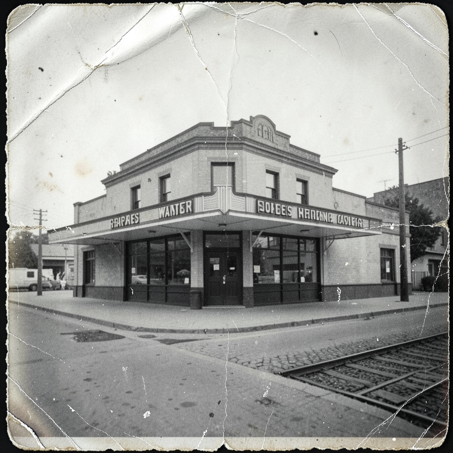 | 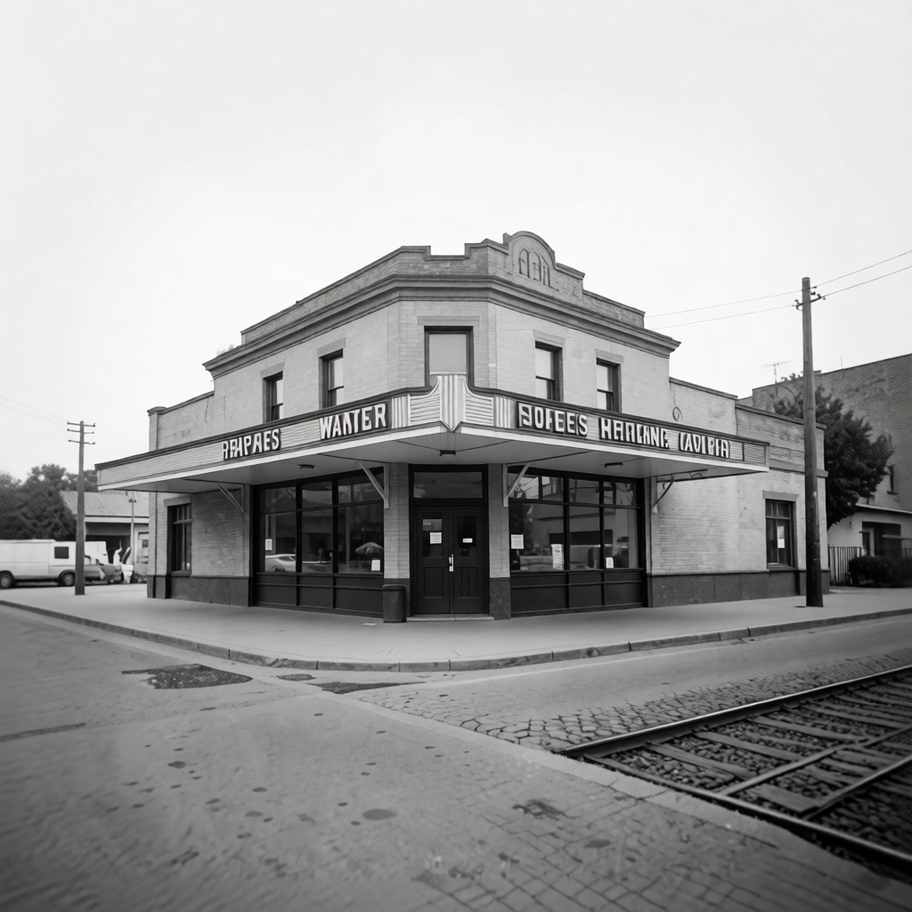 |

### Game assets and visual prototyping

A rough sketch can become a prop, inventory icon, storyboard element, or
art-direction reference before anyone commits to production geometry. Here a
beetle-shaped lantern sketch became an isometric fantasy-game prop.

| Locally generated concept sketch | FLUX.2 Klein game-prop visualization |
|---|---|
|  |  |

This is not a final mesh. It is fast visual language for deciding what is worth
modeling.

### Synthetic data and evaluation fixtures

Controlled lighting, background, and viewpoint variants can bootstrap a
computer-vision test set or exercise an inspection pipeline. I generated a
fictional valve as the reference, then produced a low-light workshop variant
while keeping the defining geometry and color scheme.

| Synthetic reference object | Controlled low-light variant |
|---|---|
| 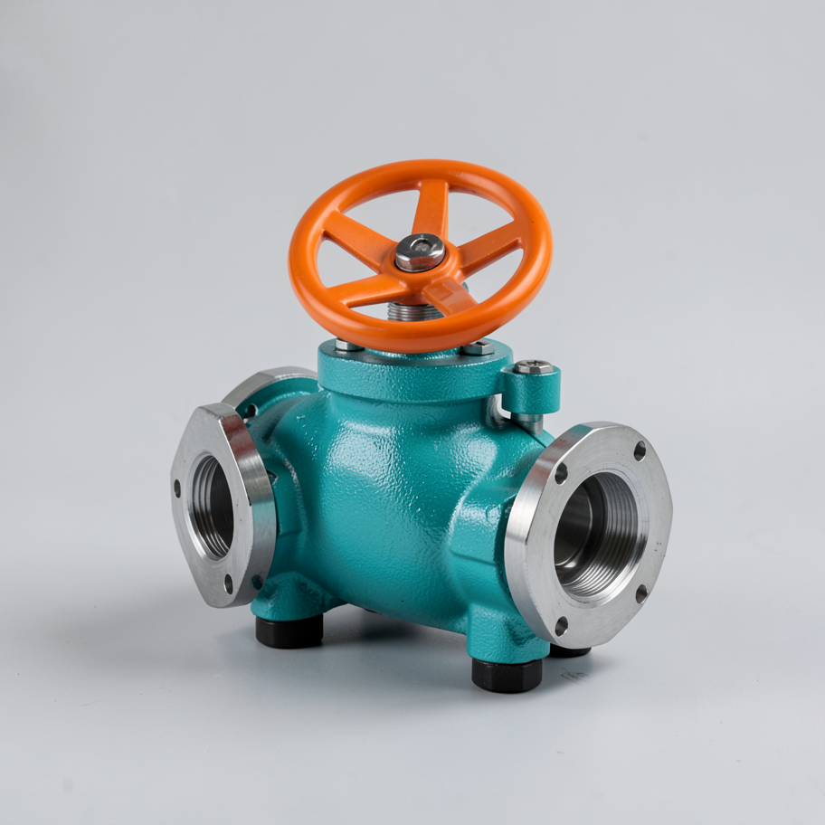 | 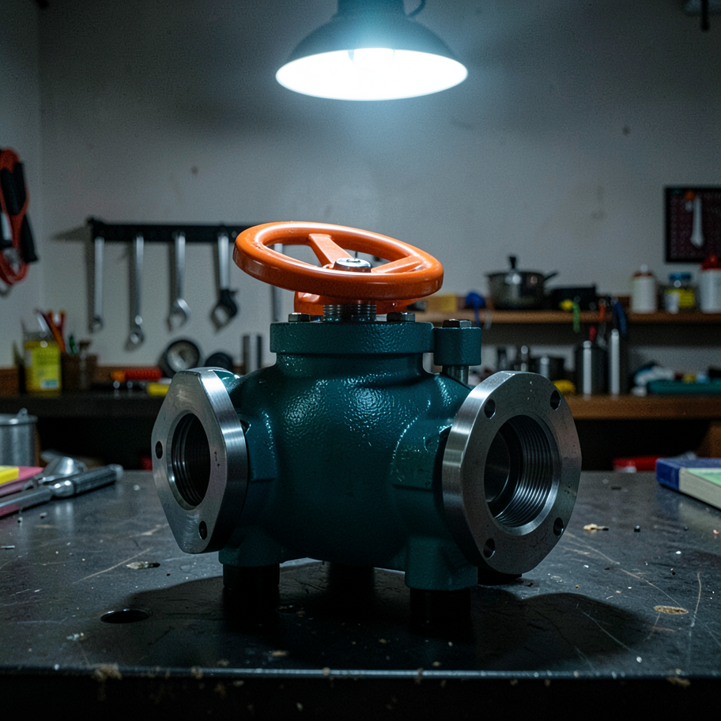 |

Synthetic data still needs identity checks, coverage analysis, and validation
against real data. It supplements a test set; it does not certify one.

### Confidential design iteration

Unreleased packaging, industrial concepts, and client sketches can stay inside
a local network. This fictional charging-stand sketch demonstrates the path
from an early marker drawing to a design-review render.

| Early industrial-design sketch | Local preproduction render |
|---|---|
| 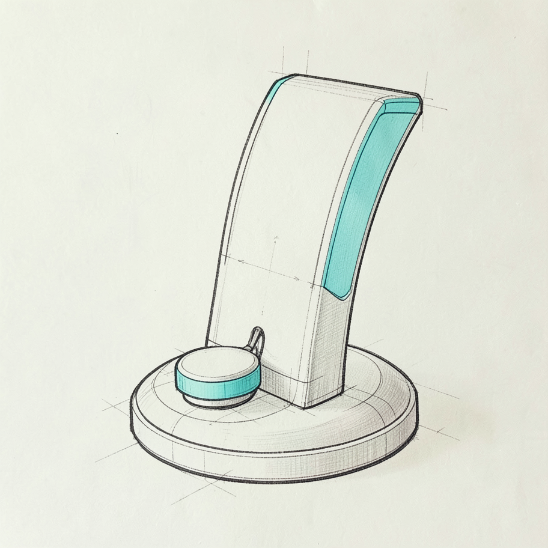 | 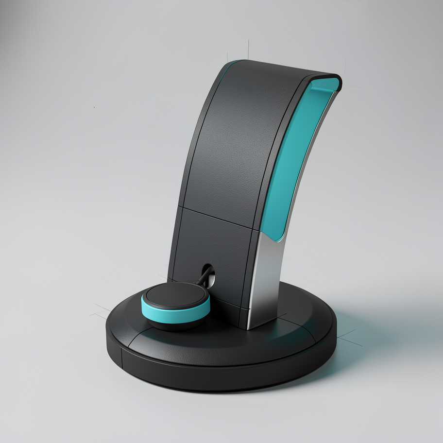 |

### Diagrams and presentation visuals

Local models can turn a rough composition into a presentation-ready visual
layer. I would still add labels, measurements, citations, and numbers with
deterministic code; a convincing label is not necessarily a correct label.

| Rough energy-flow sketch | Clean unlabeled presentation visual |
|---|---|
| 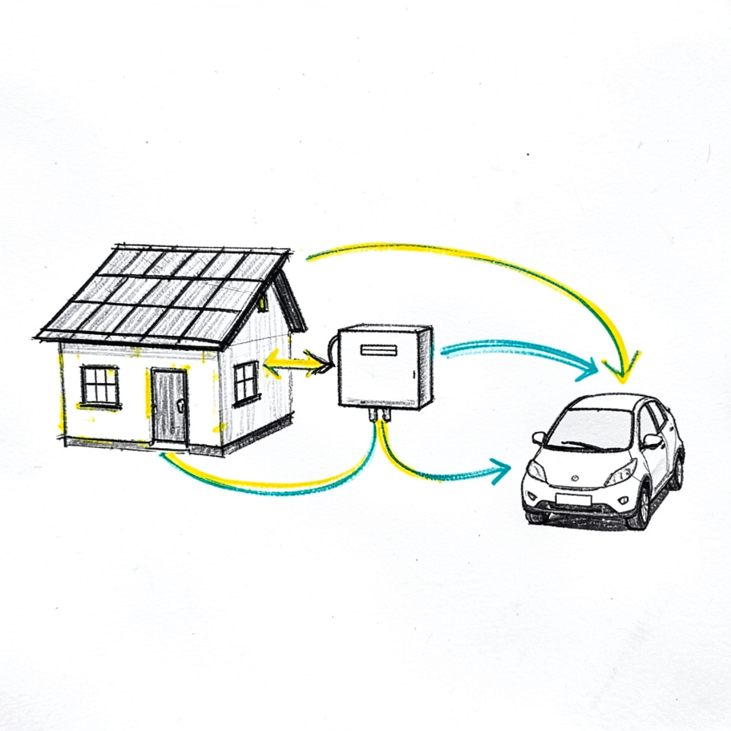 | 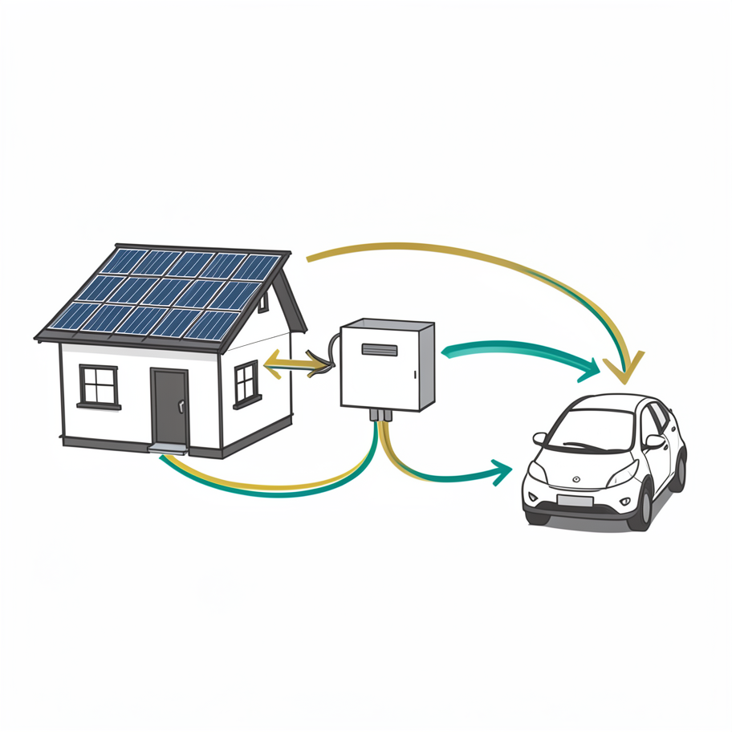 |

### Offline creative tools

A local worker can power a desktop sketch enhancer, private photo kiosk,
storytelling tool, or batch editor without API availability or rate limits. A
simple crayon lighthouse became a layered storybook composition while keeping
the original subjects and palette recognizable.

| Locally generated crayon input | FLUX.2 Klein storybook treatment |
|---|---|
| 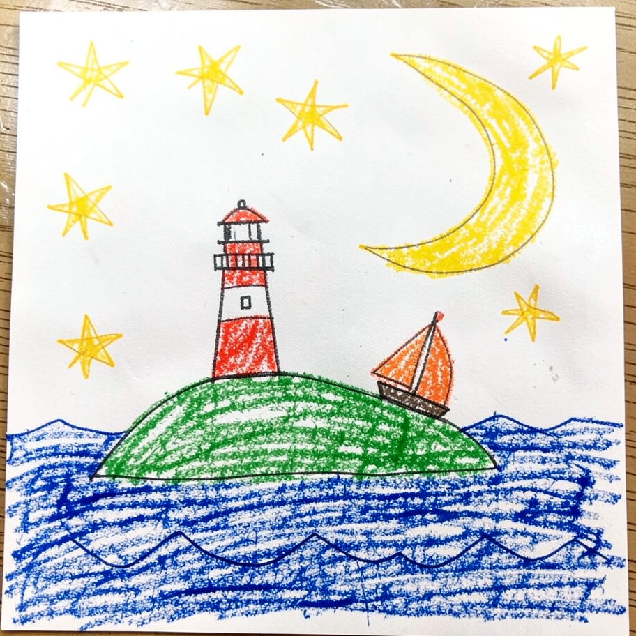 |  |

## The workflow I would build now

I would not expose a model selector first. I would expose intent.

1. Analyze the source into a structured preservation contract.
2. Classify the requested asset as hero, lifestyle, detail, scale, gift context, cleanup, concept, or controlled variant.
3. Route text-free visual work to FLUX.2 Klein by default.
4. Route text-sensitive and identity-sensitive work to native Qwen Image Edit.
5. Generate more than one candidate only when the quality policy needs it.
6. Validate product geometry, source text, scene plausibility, contact, and obvious artifacts.
7. Add dimensions and factual overlays with code.
8. Record the model, quantization, workflow version, seed, resolution, prompt hash, and timing class.

I would keep a cloud provider as an explicit fallback for unsupported requests, unavailable workers, or repeated local validation failures. The fallback should be a visible policy with cost and privacy controls, not an invisible retry.

## What I would test next

The largest weakness in this research is the small, evolving corpus. I explored aggressively and reviewed every candidate, but I did not run a fixed multi-product benchmark with blind scoring.

The next serious phase would include at least ten owned products spanning text-heavy, reflective, translucent, soft, irregular, and highly textured objects. Each accepted route would run fixed seeds across hero, lifestyle, and detail prompts. Evaluation would combine OCR, perceptual similarity, segmentation overlap, artifact checks, and human preference scoring.

I would also keep cold-start, warm-model, repeated-prompt, and varied-prompt latency separate. A cached prompt is interesting engineering data, but it is not representative of a service generating a different image brief on every request.

## Final take

The RTX 5060 Ti 16 GB is not a miniature datacenter. It is also much more capable than I expected.

The most important lesson was not that one model won. It was that a useful local image system is a routing and evaluation problem:

- FLUX.2 Klein makes attractive, text-free scene iteration genuinely fast;
- native Qwen Image Edit is the quality route I trust most for identity-sensitive work;
- quantization can solve memory without solving total latency;
- 16 GB is enough to do serious work and small enough to teach you exactly what consumes memory;
- prompt structure, camera language, and preservation contracts matter as much as model names;
- cloud economics favor convenience, while local economics favor volume, privacy, and experimentation.

Most of all, this was fun. There is something satisfying about watching a consumer card turn an ordinary photograph into a scene that would have taken real time and space to stage, then opening the graph and figuring out why it worked. Affordable local AI is no longer only a demo. It is a practical engineering medium, with enough constraints left to keep it interesting.
