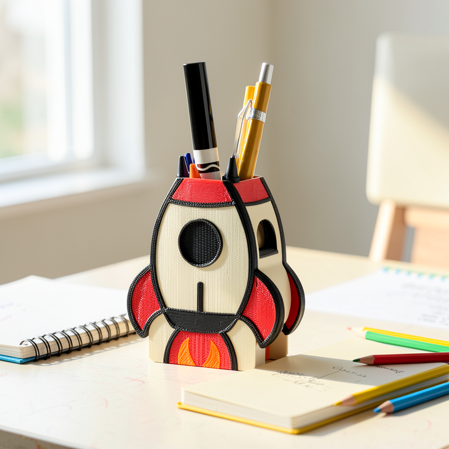
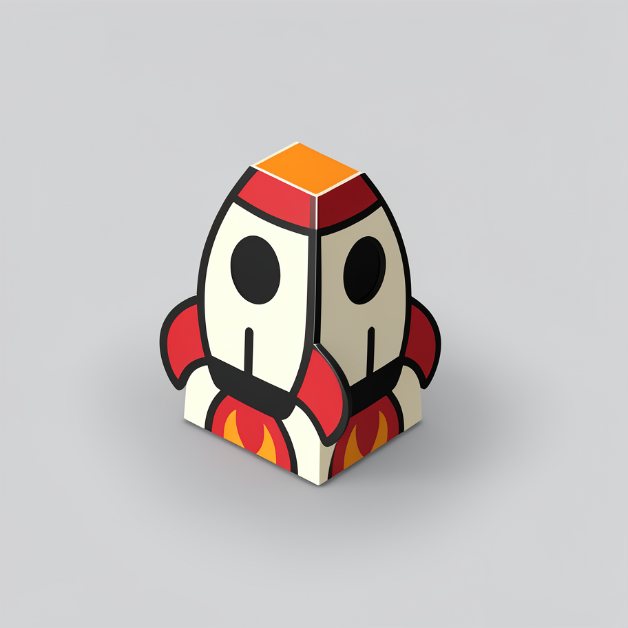
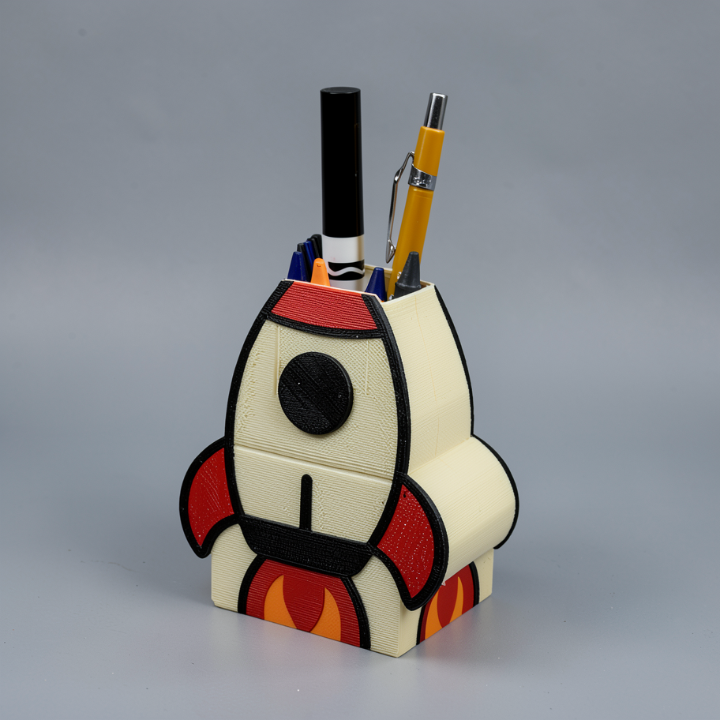

# Local Image Model Lab

How far can a $530 refurbished consumer GPU go with current open image-editing models?

This repository documents a hands-on experiment with an **RTX 5060 Ti 16 GB**, ComfyUI, native Qwen Image Edit, FLUX.2 Klein, several quantizations, and a lot of prompt iteration. The practical test was intentionally demanding: take an ordinary photo of a 3D-printed product, even when the lighting and background are not ideal, and turn it into polished Etsy-ready photography without rebuilding a tabletop studio for every shot.

| Ordinary source photo | Local FLUX.2 Klein edit, 8.4 s warm |
|---|---|
|  |  |

The short answer is **yes**, with qualifications. The 16 GB RTX 5060 Ti is capable of attractive, useful image edits. The best system was not one model for every request:

- **FLUX.2 Klein 4B is my practical default for fast scene generation when the new scene does not need generated text.** It was dramatically faster than the other serious contenders and produced consistently attractive composition. A warmed FP8 run completed in 8.4 seconds in the July follow-up, and the accepted NVFP4 routes reached roughly 4-7 seconds.
- **Native Qwen Image Edit 2511 is my personal quality favorite.** It was the most dependable option when source identity, product artwork, or existing text mattered. The best prior warm configuration was roughly 11-12 seconds at two steps.
- **Nunchaku was useful research, not the setup I would choose.** Its strongest single result was excellent, but the tested route took roughly 25-27 seconds, required more custom-runtime work, and did not beat native Qwen on the complete speed/quality/operability tradeoff.

That distinction is the central finding of the project. A benchmark winner is not automatically the best system.

## The real goal

Lighting and placing physical products is slow. For a small run of 3D-printed items, a creator may need to clear a surface, find props, move lights, control reflections, shoot several angles, and repeat the process whenever the design changes.

I wanted to know whether a local workflow could start with a quick phone photo and do the expensive part of the visual staging digitally:

1. preserve the actual object, materials, proportions, colors, texture, and important artwork;
2. replace poor lighting and a distracting background;
3. place the object naturally in a scene that makes sense for it;
4. produce a clean hero, lifestyle scene, detail view, or controlled variant;
5. return results quickly enough to support iteration.

The source image above is a better representation of that goal than a perfect studio input. The model had to understand a real, printed object and make it belong in a new environment.

## Why local?

Cloud image APIs are excellent, but per-image pricing changes how freely I experiment. As of **July 15, 2026**, common API prices span roughly **$0.014 to $0.25 per image**, depending on provider, resolution, and quality. One result is rarely enough. Ten assets, four candidates each, and a few prompt revisions can turn one product into dozens or hundreds of calls.

Local inference changes the marginal cost. Using a conservative 250 W whole-system estimate, an 8.4-second image consumes about 0.00058 kWh. At the U.S. Energy Information Administration's 2026 summer estimate of 18.27 cents/kWh, that is about **$0.00011 of electricity per image**. Hardware, time, maintenance, and storage are still real costs, but another seed no longer feels like another purchase.

At a $530 hardware cost, simple break-even points are:

| Avoided cloud cost | Images to recover $530 | Electricity at 8.4 s/image |
|---:|---:|---:|
| $0.014/image | 37,857 | about $4.00 total |
| $0.067/image | 7,911 | about $0.84 total |
| $0.167/image | 3,174 | about $0.34 total |

Those are intentionally simplified. A low-volume user should probably rent the cloud. The local case becomes compelling for repeated experimentation, batch generation, private source material, offline work, and a machine that also runs local LLMs, coding models, transcription, embeddings, and other AI experiments. See [Cost and privacy](docs/cost-and-privacy.md) for assumptions and caveats.

## Why a 5060 Ti 16 GB?

I bought a **PNY Dual Fan OC GeForce RTX 5060 Ti 16 GB GDDR7** refurbished for **$530** from [Newegg](https://www.newegg.com/pny-technologies-inc-rtx-5060-ti-16gb-dual-fan-oc-geforce-rtx-5060-ti-graphics-card-double-fans/p/N82E16814985024?item=N82E16814985024).

This was never only an image-generation purchase. I wanted a card that could support broad local-AI experimentation: image editing, multimodal models, speech, embeddings, coding assistants, and useful local LLMs. Eight gigabytes would have required compromises too early. Twelve gigabytes looked like my minimum, but the 16 GB deal offered the best balance of capacity, CUDA compatibility, Blackwell precision support, power, and price that I could actually buy.

Current street prices are volatile. This snapshot records ordinary U.S. asking prices observed on **July 15, 2026**, excluding one-off clearance deals and extreme marketplace listings:

| GPU | VRAM | Observed price band | Local-AI interpretation |
|---|---:|---:|---|
| RTX 5060 Ti | 8 GB | $360-$395 | Affordable compute, but too little headroom for the mix of work I wanted |
| RTX 5060 Ti | 16 GB | $565-$570 | Strong capacity-per-dollar in the CUDA ecosystem; my refurbished unit was $530 |
| RTX 5070 | 12 GB | $550-$670 | More compute, less memory; a poor trade for memory-bound graphs |
| RTX 5070 Ti | 16 GB | $900-$1,100 | Faster at the same capacity tier, with a much higher entry cost |
| RTX 5080 | 16 GB | $1,250-$1,600 | Much faster, but still 16 GB and far outside the affordable-entry goal |
| Used RTX 3090 | 24 GB | $1,189-$1,292 fair asking | Valuable headroom, high power, used-market risk, and unusual 2026 pricing |
| RX 9060 XT | 16 GB | $400-$460 | Excellent paper value; validate the exact Windows and custom-node stack first |
| RX 9070 XT | 16 GB | $690-$850 | Strong hardware value with more software-path uncertainty for this test matrix |
| Intel Arc B580 | 12 GB | $300-$310 | Interesting entry option, but less capacity and a narrower tested ecosystem |

The surprise was that even 16 GB remained constrained. Image pipelines are not sized by diffusion-parameter count alone. The graph may include a vision-language text encoder, VAE, LoRA, reference-image latents, attention buffers, intermediate tensors, and two model families moving between RAM and VRAM. Native Qwen peaked near 15.3 GB in one monitored run and still had to offload components.

The same reasoning applies to LLMs. A 12B model such as [Gemma 4 12B](https://huggingface.co/google/gemma-4-12B) is about 24 GB in BF16 before runtime overhead. A 4-bit quantization can make it practical, but context cache, multimodal inputs, and runtime buffers still consume memory. [Qwen3.6](https://huggingface.co/collections/Qwen/qwen36) currently starts at 27B dense or 35B-A3B MoE, so meaningful local use requires stronger quantization and careful context sizing. Sixteen gigabytes does not remove constraints; it leaves enough room to explore them productively.

More detail and source links are in [Hardware selection](docs/hardware-selection.md).

## What I would run

| Role | Configuration | Observed warm latency | Why |
|---|---|---:|---|
| Practical default | FLUX.2 Klein 4B FP8 distilled, 0.8 MP, 6 steps | about 7-8 s | Attractive composition and strong consistency when no new scene text is required |
| Quality favorite | Native Qwen Image Edit 2511 mixed FP8 + Lightning, 768-class, 2 steps | about 11-12 s | Best general preservation of product identity, artwork, and existing text |
| Fast preview | FLUX.2 Klein 4B NVFP4, 0.8 MP, 4 steps | about 4-5 s | Interactive visual direction at the lowest accepted latency |
| Larger fast preview | FLUX.2 Klein 4B NVFP4, 1.2 MP, 4 steps | about 6-7 s | More pixels without losing interactive speed |
| Tested, not selected | QuantFunc Qwen 2511 FP4 through Nunchaku, 0.8 MP | about 25-27 s | Excellent single outputs, but slower and operationally heavier than native Qwen |

### FLUX.2 Klein: the practical winner


This is the configuration I would reach for most often. FLUX is fast enough to make prompt and seed exploration feel interactive. It also has a strong eye for lighting, camera position, props, and coherent scene composition. Its weak point is not general aesthetics; it is asking the model to invent or preserve exact text and intricate identity-sensitive artwork. When the target scene does not need text, that limitation matters much less.

### Native Qwen: my quality favorite


Native Qwen produced the most faithful product edits across the experiments. It was the route I trusted when small geometry changes, personalized lettering, or existing artwork could make an otherwise beautiful image unusable. The two-step Lightning configuration was also faster than the Nunchaku route in the controlled warm tests.

### Why Nunchaku is not the recommendation

Nunchaku deserves documentation because getting Qwen FP4 running on Blackwell taught me a lot about model provenance, custom wheels, architecture-specific formats, and end-to-end bottlenecks. It also produced one of the strongest individual sign images.

It did not become my preferred system. The tested community checkpoint took roughly 25-27 seconds, required a more fragile custom runtime, and still paid for Qwen's large text encoder, VAE, graph transitions, and output work. A lower-bit diffusion model does not automatically produce a faster application. The full record is in [Experiment log](docs/experiment-log.md).

## Prompt engineering mattered

The workflow improved as much from prompt structure as from model changes. The most reliable prompts had four parts:

1. **Preservation contract:** name the exact source traits that may not change.
2. **Scene brief:** describe one asset type and one believable environment.
3. **Physical integration:** specify camera angle, light direction, contact shadow, reflections, and depth of field.
4. **Exclusions:** explicitly reject duplicate products, invented text, labels, callouts, and irrelevant props.

For example:

```text
Create a polished lifestyle photograph of the exact 3D-printed rocket-shaped
pen organizer from the reference. Preserve the cream body, red fins, black
outlines, orange flame, circular window, storage geometry, and visible print
texture. Place it naturally on a bright homework desk with soft morning window
light, a realistic contact shadow, and an uncluttered background. Keep the
organizer as the clear subject at a natural three-quarter angle. Do not add,
remove, duplicate, resize, or redesign it. No text, labels, badges, arrows,
hands, or people.
```

Longer is not always better. The useful detail is a ranked contract, not a wall of adjectives. Prompts, denoise, steps, seed policy, and evaluation rules together form the editing system. See [Prompt engineering](docs/prompt-engineering.md) for templates, failure cases, and model-specific guidance.

## Beyond product photography

The same local setup is useful anywhere privacy, volume, repeatability, or integration control matters.

| Private photo cleanup | Game and asset ideation | Synthetic-data variation |
|---|---|---|
|  |  |  |
| The private source never has to leave the machine. This approved result is public; the input is intentionally not. | A real object can become a game prop, storyboard element, or visual direction without starting from a blank prompt. | Controlled viewpoint and lighting variants can bootstrap evaluation or computer-vision experiments, with human review for identity drift. |

Other useful directions include confidential client mockups, restoration, interior cleanup, color and material exploration, visual regression fixtures, offline creative tools, presentation art, and diagram backgrounds. Exact labels, dimensions, and factual annotations should still be rendered with deterministic code, not trusted to the image model. See [Use cases](docs/use-cases.md).

## Repository map

- [Long-form article](ARTICLE.md) - the narrative version for a blog or portfolio.
- [Experiment log](docs/experiment-log.md) - every major model path and why it was accepted or rejected.
- [Prompt engineering](docs/prompt-engineering.md) - the prompt system, templates, and failure analysis.
- [Hardware selection](docs/hardware-selection.md) - current prices, VRAM reasoning, and broader local-AI use.
- [Cost and privacy](docs/cost-and-privacy.md) - cloud comparison, break-even math, and privacy boundaries.
- [Workflow design](docs/workflow-design.md) - how to turn the experiments into a service pipeline.
- [Methodology](docs/methodology.md) - timing and evaluation rules.
- [Reproducibility](docs/reproducibility.md) - environment capture and workflow runner.
- [Benchmark data](data/benchmark-results.csv) - raw summarized observations.
- [July follow-up run manifest](data/followup-runs-2026-07-15.json) - exact prompts, seeds, environment, timing classes, and outputs for the new examples.
- [ComfyUI workflow templates](workflows/README.md) - parameterized API graphs.

## Reproducing a run

The repository includes parameterized ComfyUI API workflows and a standard-library runner:

```powershell
python scripts/run_workflow.py `
  --server http://127.0.0.1:8000 `
  --template workflows/flux2-klein-4b-edit-api.json `
  --image path/to/source.png `
  --prompt "Keep the exact product unchanged and place it on a bright desk." `
  --output-dir output/flux `
  --set DIFFUSION_MODEL=flux-2-klein-4b-fp8.safetensors `
  --set TEXT_ENCODER=qwen_3_4b_fp4_flux2.safetensors `
  --set VAE_MODEL=flux2-vae.safetensors `
  --set MEGAPIXELS=0.8 `
  --set STEPS=6 `
  --set CFG=1.0 `
  --set SEED=7731902
```

Model weights are not redistributed. Check every model and adapter license at the revision you use.

## Scope and honesty

These are end-to-end observations from one Windows workstation, not universal inference benchmarks. Timing changes with runtime versions, model residency, prompt caching, source dimensions, and graph construction. One beautiful seed is evidence, not a guarantee. The next step for this project is a broader fixed corpus with repeated seeds, OCR, identity checks, and blind human preference scoring.

The point is not that local always beats cloud. It is that affordable consumer hardware is now capable enough to make the tradeoff interesting, useful, and genuinely fun to explore.
