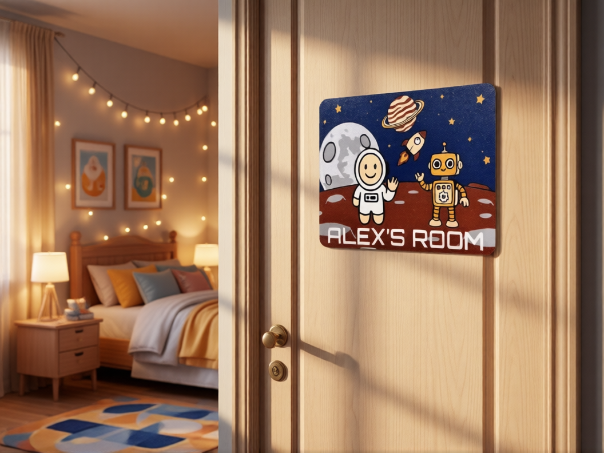
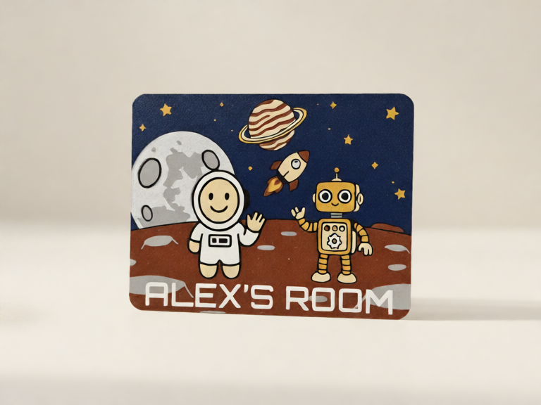
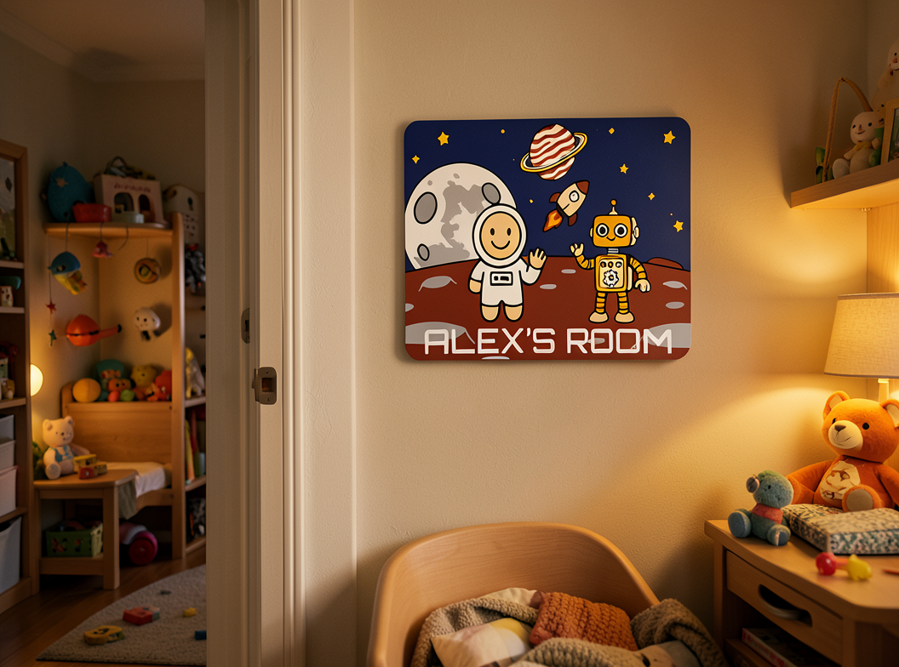
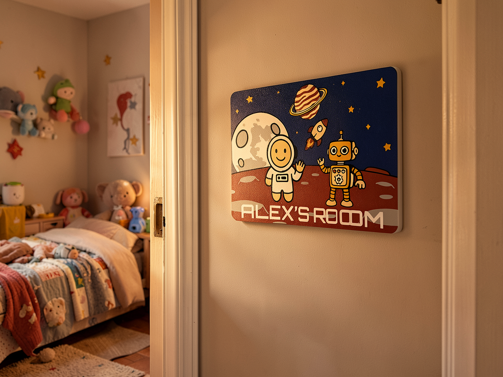
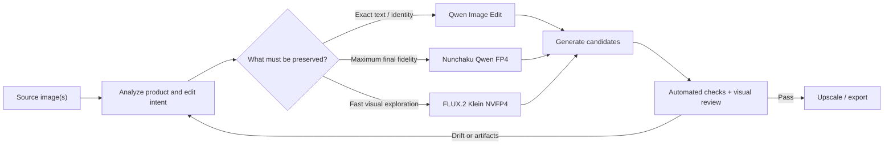

# Local Image Model Lab

## What can a $530 consumer GPU actually do?

I built this lab to answer a practical question: **how far can I push modern open image models on affordable hardware that fits under a desk?**

The test case was deliberately unforgiving. One concrete goal was generating a strong Etsy listing image set from an ordinary product photo. I asked local models to create polished listing photography while preserving the exact product, artwork, proportions, texture, and personalized text. A pretty image was not enough. It still had to be the same product.

The short answer: a 16 GB **GeForce RTX 5060 Ti** can produce genuinely useful image edits locally. The best configuration took about **25-27 seconds** for a 0.8 MP final image. Fast preview routes reached **4-7 seconds**. Getting there required much more than picking the newest model: quantization, text encoders, VRAM behavior, resolution, step count, warm-up, and product fidelity all changed the result.

This repository contains the experiment log, representative outputs, benchmark data, and reusable ComfyUI API workflows behind that conclusion.

> These are measurements from one Windows workstation and one difficult source image, not universal model rankings. Treat them as an engineering case study and a starting point for your own hardware.

## The question I tested

Could a developer build a useful local image-editing pipeline that:

- runs on a reasonably priced consumer GPU;
- accepts a real source image, not just a text prompt;
- creates studio and lifestyle product photography;
- preserves identity, artwork, geometry, and printed text;
- returns previews in seconds and stronger finals in under 30 seconds;
- keeps private or unreleased images on the local machine?

The product-photo use case is useful beyond e-commerce. It exposes the same problems that matter in private photo editing, brand mockups, design iteration, synthetic data, and any workflow where the source image cannot casually drift.

## Hardware

The test machine uses a **PNY Dual Fan OC GeForce RTX 5060 Ti 16 GB GDDR7**. I paid **$530 refurbished** at [Newegg](https://www.newegg.com/pny-technologies-inc-rtx-5060-ti-16gb-dual-fan-oc-geforce-rtx-5060-ti-graphics-card-double-fans/p/N82E16814985024?item=N82E16814985024).

That was not the lowest historical price for the GPU; NVIDIA launched the 16 GB model at $429. It was the best fit I could actually buy for this experiment: 16 GB of VRAM, Blackwell FP4 support, moderate 180 W board power, and the least-friction Windows path through CUDA, PyTorch, ComfyUI, and custom nodes.

| Option | VRAM | Launch/SEP | Why I considered it | Why it was not my choice |
|---|---:|---:|---|---|
| RTX 5060 Ti 16 GB | 16 GB | $429 | Enough VRAM for quantized edit models, Blackwell FP4, 180 W, mature CUDA tooling | Not the fastest card, and my $530 refurbished price was above launch MSRP |
| RTX 5070 | 12 GB | $549 | More raw compute | Less VRAM for a workload where model fit mattered more than gaming-class throughput |
| RTX 5070 Ti | 16 GB | $749 | Faster while keeping 16 GB | A much larger starting investment and 300 W board power |
| Used RTX 3090 | 24 GB | $1,499 launch; used prices vary | The most useful VRAM headroom in this group | High power, used-condition risk, older architecture, no Blackwell FP4 path |
| Radeon RX 9060 XT 16 GB | 16 GB | $349 SEP | Excellent VRAM-per-dollar on paper | Windows/ComfyUI support was improving but still less predictable than CUDA for this node stack |
| Intel Arc B580 | 12 GB | $249 | Compelling low-cost experimentation | 12 GB and a less mature compatibility path for the exact models and custom nodes tested |

Read the full decision record in [Hardware selection](docs/hardware-selection.md).

## What worked

There was no single winner for every request. The practical answer was a **small route table**:

| Tier | Configuration | Observed warm time | Best use | Main tradeoff |
|---|---|---:|---|---|
| Best | QuantFunc Qwen 2511 ultimate-speed FP4 through Nunchaku, 0.8 MP | 25-27 s | Text-sensitive final images | Community quantization; slower than preview routes |
| Great A | Native Qwen Image Edit 2511 + Lightning, 768-class, 2 steps | 11-12 s | Strong product-preserving default | Dynamic loading makes cold runs slower |
| Great B | FLUX.2 Klein 4B FP8 distilled, 0.8 MP, 6 steps | ~7 s | Attractive scenes when exact lettering is not critical | Can rewrite artwork and text |
| Base | Native Qwen Image Edit 2511 + Lightning, 640-class, 2 steps | ~12 s with varied prompts | Lower-resolution fidelity-first preview | Small output limits fine detail |
| Speed+ | FLUX.2 Klein 4B NVFP4, 1.2 MP, 4 steps | 6-7 s | Larger fast preview | More identity drift than Qwen |
| Speed | FLUX.2 Klein 4B NVFP4, 0.8 MP, 4 steps | 4-5 s | Interactive iteration | Lowest fidelity among accepted tiers |

The timings above are end-to-end ComfyUI API observations after model warm-up. They include text conditioning, sampling, VAE work, and output handling. See [Methodology](docs/methodology.md) and [benchmark results](data/benchmark-results.csv).

## One source, several lessons

### Source photo

The source is a difficult edit target: small printed details, recognizable characters, a textured surface, rounded corners, and personalized lettering. It is easy for a model to make the scene more attractive by quietly inventing a different product.

### Fidelity-first Qwen result

Native Qwen Image Edit with a low-step Lightning adapter produced the best speed-to-fidelity balance. The scene is simple, but the product remains recognizable and the name stays intact.

### Best final: Nunchaku-compatible Qwen

The tested route used QuantFunc's community Qwen 2511 FP4 checkpoint through the Nunchaku ComfyUI runtime. It gave the strongest combination of product preservation and natural scene integration. On this 16 GB Blackwell card it became the final-quality route, not the preview route. The checkpoint is not an official Nunchaku release; that distinction matters for provenance and support.

### Beautiful is not the same as correct

FLUX.2 Klein generated an appealing room in roughly seven seconds, but changed `ALEX'S ROOM` to `LEX'S ROOM` and altered the artwork. That is a useful model when creativity is welcome, and a bad default when a buyer expects the photographed product.

### The fast previews were more than thumbnails

| Speed: NVFP4, 0.8 MP, 4-5 s | Speed+: NVFP4, 1.2 MP, 6-7 s |
|---|---|
|  |  |

These particular outputs preserved the lettering and look remarkably polished for their latency. The separate FP8 example above demonstrates why one successful image is not a fidelity guarantee: FLUX could preserve the product on one seed and rewrite it on another. I kept these routes as previews and required validation before publication.

### Slower models were not automatically better

| FireRed Image Edit, ~74 s | LongCat GGUF, ~42 s | Z-Image experiment, ~32 s |
|---|---|---|
|  |  |  |
| Excellent preservation, but too slow for the target. | Solid preservation, but behind the accepted routes on latency. | Preserved too much of the source setting and introduced obvious artifacts. |

## The workflow that emerged

The most important design decision was to stop treating model selection as a global setting. Product-preserving edits, fast previews, and creative scene generation are different jobs. A production pipeline should route between them and reject outputs that fail identity, text, geometry, or artifact checks.

Read [Workflow design](docs/workflow-design.md) for the proposed end-to-end pipeline.

## Why GPU utilization looked low

The GPU was not idle because the diffusion model was weak. Qwen's image model, vision-language text encoder, VAE, LoRA, and runtime overhead do not all fit comfortably in 16 GB at once. ComfyUI dynamically loads and offloads components, so end-to-end utilization includes CPU-to-GPU transfers and text-encoder work. In one monitored native Qwen run, utilization averaged about 47%, peaked at 99%, and VRAM peaked near 15.3 GB.

That explains several otherwise surprising results:

- warm runs were dramatically faster than cold runs;
- changing prompts could cost more than repeating the same prompt;
- forcing `--highvram` caused Qwen to hang instead of making it faster;
- a smaller or quantized diffusion model did not eliminate the text-encoder bottleneck;
- Blackwell-native FP4 helped most when the whole node stack supported it well.

## Models explored

- Qwen Image Edit 2511, native mixed FP8 and Lightning LoRA
- Qwen Image Edit GGUF Q2 and Q3 variants
- QuantFunc Qwen Image Edit 2511 FP4, ultimate-speed and balanced community quantizations through Nunchaku
- FLUX Kontext
- FLUX.2 Klein 4B FP8 distilled, base, and NVFP4 variants
- LongCat Image Edit Turbo, official BF16 and GGUF Q3/Q4/Q5 variants
- FireRed Image Edit 1.1 Q3_K_M with an 8-step Lightning adapter
- Z-Image Turbo Q3_K_M image-to-image
- SDXL and background-compositing experiments during the earliest iteration

The detailed chronology is in [Experiment log](docs/experiment-log.md).

## Beyond product photos

The same local stack can support:

- private photo cleanup, relighting, background replacement, and restoration;
- confidential product-concept and packaging mockups;
- game, UI, presentation, and marketing asset prototyping;
- storyboards and social-media variants;
- synthetic images for tests, demos, and computer-vision datasets;
- architecture-diagram backgrounds and visual concepts, with deterministic text overlaid afterward;
- batch normalization of catalog photography;
- offline creative tools for classrooms, workshops, and travel.

Local does not automatically mean private or safe. Workflows still need access controls, output review, model-license review, and clear provenance. See [Local image use cases](docs/use-cases.md).

## Reproduce the lab

1. Install current [ComfyUI](https://docs.comfy.org/installation/system_requirements) on a supported CUDA/PyTorch environment.
2. Download model files from their official model cards; this repository does not redistribute weights.
3. Install the custom nodes required by a selected workflow, including [ComfyUI-nunchaku](https://github.com/nunchaku-ai/ComfyUI-nunchaku) for the Nunchaku route.
4. Copy a template from [`workflows/`](workflows/) and replace its `{{PLACEHOLDERS}}`.
5. Run the generic API client in [`scripts/run_workflow.py`](scripts/run_workflow.py).
6. Record cold and warm runs separately and inspect every output at full resolution.

Exact versions matter. Start with [Reproducibility](docs/reproducibility.md), then check each upstream model license before commercial use.

## Repository map

| Path | Contents |
|---|---|
| [`ARTICLE.md`](ARTICLE.md) | Long-form, blog-ready version of the story |
| [`docs/hardware-selection.md`](docs/hardware-selection.md) | GPU comparison and purchase rationale |
| [`docs/methodology.md`](docs/methodology.md) | Test protocol, scoring rubric, and caveats |
| [`docs/experiment-log.md`](docs/experiment-log.md) | Model-by-model findings and dead ends |
| [`docs/workflow-design.md`](docs/workflow-design.md) | Proposed local image-editing pipeline |
| [`data/benchmark-results.csv`](data/benchmark-results.csv) | Machine-readable observations |
| [`workflows/`](workflows/) | Parameterized ComfyUI API templates |
| [`scripts/`](scripts/) | Minimal ComfyUI API workflow runner |
| [`docs/references.md`](docs/references.md) | Hardware, model, and runtime sources |

## Status

This is an experiment log, not a frozen leaderboard. Model releases, quantization support, PyTorch kernels, and ComfyUI nodes move quickly. I plan to keep adding repeatable tests rather than quietly replacing old conclusions.

Code is available under the [MIT License](LICENSE). Written content is available under [CC BY 4.0](CONTENT_LICENSE.md). Sample-image terms are described in [ASSET_LICENSE.md](ASSET_LICENSE.md).
