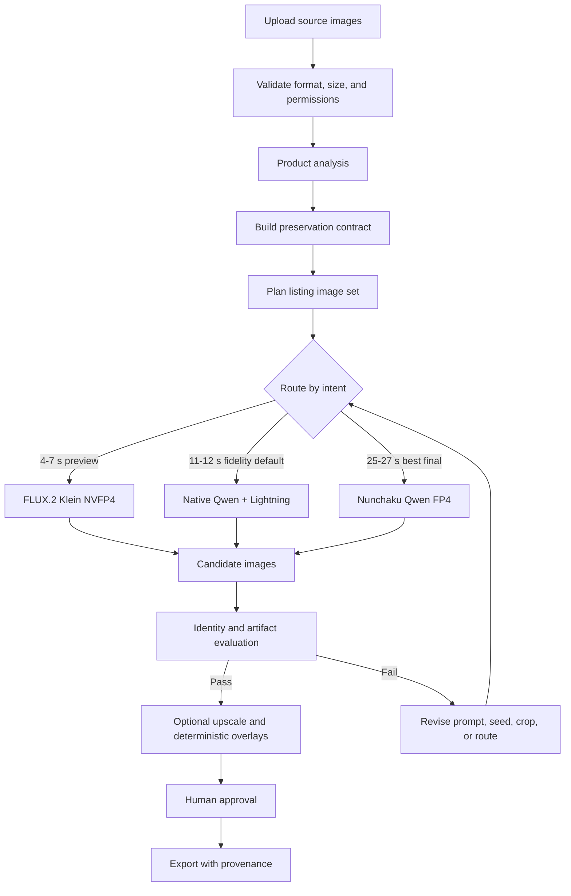
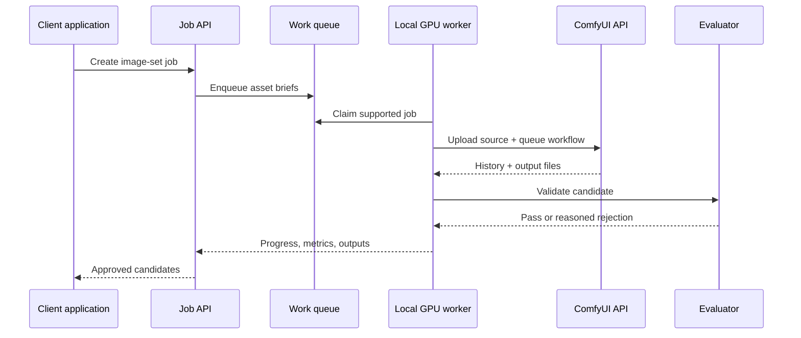

# Workflow design

## Goal

Turn one or more ordinary source photos into a coherent set of product images while preserving the actual item. The workflow should support local execution first and make model choice an explicit routing decision.

## Proposed pipeline



## 1. Intake

Accept multiple source views when available. Preserve the original files and metadata separately from working derivatives.

Validate:

- supported image type and dimensions;
- decode success and orientation;
- duplicate or near-duplicate inputs;
- obvious blur, clipping, glare, or occlusion;
- whether the user has permission to edit the image;
- whether faces, addresses, IDs, or other sensitive content require special handling.

## 2. Product analysis

Use a vision-language model or deterministic analysis tools to create structured metadata, not only a prose prompt.

Suggested schema:

```json
{
  "category": "personalized room sign",
  "materials": ["printed hardboard"],
  "shape": "rounded rectangle",
  "dominantColors": ["navy", "rust", "white", "yellow"],
  "exactText": ["ALEX'S ROOM"],
  "identityFeatures": [
    "astronaut on left",
    "yellow robot on right",
    "striped planet at top",
    "navy space background"
  ],
  "physicalConstraints": [
    "do not add a frame",
    "preserve rounded corners",
    "do not change aspect ratio"
  ],
  "riskFlags": ["text-sensitive", "artwork-sensitive"]
}
```

The schema becomes a preservation contract used by prompting, routing, and evaluation.

## 3. Image-set planning

Generate explicit asset briefs. A useful general product set might contain:

| Slot | Purpose | Typical composition |
|---|---|---|
| Hero | Immediate product clarity | Clean background, product dominant, no invented callouts |
| Lifestyle | Show realistic use | Product naturally installed, worn, held, or placed |
| Scale | Communicate size | Familiar context or deterministic measurement overlay |
| Detail | Show material/craft | Macro crop without inventing texture |
| Gift/context | Communicate recipient or occasion | Scene supports the use case without obscuring the item |

Do not ask the model to generate factual badges, measurements, guarantees, or shipping claims. Render verified text and graphics afterward with deterministic code.

## 4. Routing

### Fidelity route

Use Qwen Image Edit when exact text, logos, artwork, or geometry matter. Start with the native 2511 + Lightning two-step route. Escalate to the tested QuantFunc Qwen 2511 ultimate-speed FP4 checkpoint through Nunchaku for a stronger final, or validate an official Nunchaku equivalent.

### Creative preview route

Use FLUX.2 Klein NVFP4 for composition exploration. Treat every result as a visual proposal. Do not promote it automatically when the preservation contract contains exact text or branded artwork.

### Deterministic composite route

Use segmentation and compositing when every source pixel must be preserved, especially for white-background catalog images, collages, or layouts with exact callouts. Generate the scene plate separately and calculate perspective, contact shadow, and color matching deterministically.

### Fallback route

A production system may optionally use a cloud editor when the local worker is unavailable, the request exceeds VRAM, or the fidelity evaluator repeatedly rejects local outputs. Make that a policy decision with explicit privacy and cost controls, not an invisible retry.

## 5. Evaluation

No single metric can validate an edit. Combine:

- OCR comparison for exact text;
- feature matching or embeddings for artwork/logo identity;
- segmentation-mask overlap and contour comparison for geometry;
- dominant-color distance;
- image-quality and artifact checks;
- prompt/scene classification;
- human review for the final set.

Store both the score and the reason for rejection. A model can then be re-routed because of `text_mismatch`, `shape_drift`, `bad_contact_shadow`, `source_background_retained`, or `scene_mismatch` instead of receiving a generic failure.

## 6. Serving architecture

ComfyUI should run as a worker behind a job API rather than being exposed directly to end users.



The worker should advertise capabilities such as GPU model, free VRAM, loaded models, supported node types, and maximum resolution. Jobs should carry deadlines and route names rather than raw model filenames.

## 7. Operational requirements

- Queue limits prevent one user from monopolizing the GPU.
- Warm pools keep the current route resident when demand justifies it.
- Model downloads are managed separately from request handling.
- Every output records model, quantization, workflow version, seed, dimensions, and prompt hash.
- Source and output retention policies are explicit.
- Failed generations are bounded by retry and cost budgets.
- Health checks verify both ComfyUI and a tiny known workflow.
- The service degrades to a slower route or queues work instead of silently reducing quality.

## 8. What remains to validate

- a multi-product benchmark corpus;
- OCR and geometry thresholds that correlate with human review;
- glass, jewelry, reflective products, apparel, and hands;
- concurrent job behavior and model-switch penalties;
- upscaling without text/art drift;
- repeatability after ComfyUI and custom-node upgrades;
- license and provenance policy for every production model.
